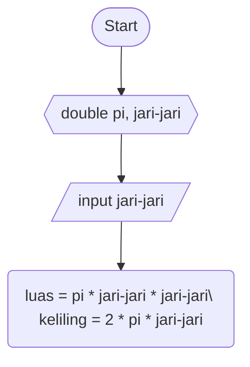

# Luas dan Keliling Lingkaran #
# Pseudocode #
deklarasi : double pi, jari-jari, luas, keliling

input pi = 3.141592653589793238462643383279502884197169399375105820974944592307816406286\
input jari-jari = read jari-jari

luas = pi * jari-jari * jari-jari\
keliling = 2 * pi * jari-jari

print luas dan keliling 

# Flowchart #

