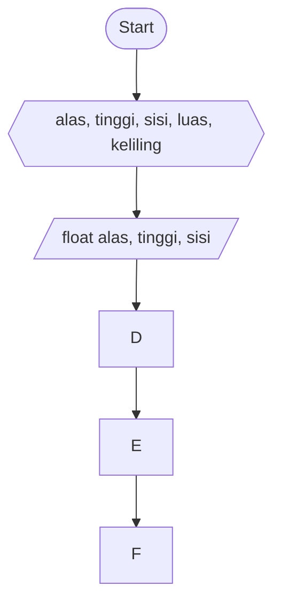

# Luas dan keliling Segitiga #
# Pseudocode #
deklarasi : float alas, tinggi, sisi, luas, keliling

input alas = read alas\
input tinggi = read tinggi\
input sisi = read sisi

luas = 0.5 * alas * tinggi\
keliling = 3 * sisi

print luas dan keliling

# Flowchart #

